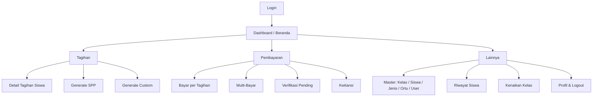

<aside>
🎯

Dokumen ini adalah **PRD UI/UX** untuk aplikasi **mobile admin pembayaran sekolah** (Android native, Java). Melengkapi *PRD Mobile Admin Backend* yang sudah ada — backend PRD fokus pada perilaku & API, dokumen ini fokus pada **desain antarmuka, alur layar, komponen, dan state**. Acuan visual mengikuti prototype fintech bersih (biru/teal, light & dark) yang sudah disetujui.

</aside>

## 1. Ringkasan & Tujuan

Menyediakan spesifikasi desain UI/UX yang lengkap dan dapat langsung diimplementasikan oleh tim pengembang Android, agar:

- Tampilan **modern, smooth, dan user-friendly** untuk admin & petugas TU sekolah.
- Konsisten secara visual di seluruh layar (satu design system).
- Memetakan setiap fitur backend ke layar, komponen, dan state yang jelas.
- Mengurangi ambiguitas saat implementasi (warna, ukuran, spasi, perilaku interaksi terdefinisi).

### Yang dibahas

- Design system (warna, tipografi, spasi, radius, elevasi, ikon)
- Komponen UI standar & perilakunya
- Arsitektur navigasi & peta layar
- Spesifikasi per layar untuk seluruh fitur
- State: loading, empty, error, sukses
- Pemetaan error backend → UI
- Motion & micro-interaction
- Aksesibilitas & lokalisasi
- Catatan implementasi Android native

### Yang tidak dibahas

- Logika bisnis & perhitungan (lihat PRD Backend)
- Kontrak API detail (lihat PRD Backend)
- Aplikasi untuk orang tua, push notification, offline mode (out of scope)

---

## 2. Prinsip Desain

<aside>
✨

**Clarity over density**

Data keuangan harus mudah dibaca. Hierarki tipografi jelas, whitespace cukup, hindari tabel padat ala spreadsheet.

</aside>

<aside>
🛡️

**Aman dari salah klik**

Aksi sensitif (bayar, approve, hapus) selalu butuh konfirmasi & feedback jelas.

</aside>

<aside>
⚡

**Smooth & responsif**

Transisi halus, animasi singkat (150–300ms), skeleton loading, feedback instan.

</aside>

<aside>
📱

**One-hand friendly**

Aksi utama di area jangkauan jempol (bottom nav, FAB, tombol di bawah).

</aside>

---

## 3. Design System

### 3.1 Warna

**Brand (Teal)**

| Token | Hex | Penggunaan |
| --- | --- | --- |
| brand-700 | #0A6571 | Gradient gelap, header login |
| brand-600 | #0B7D8C | Aksi primer, gradient |
| brand-500 | #0F9AAB | Warna utama, chip aktif, ikon aktif |
| brand-400 | #2BB3C0 | Aksen, gradient terang |
| brand-200 | #AADDE3 | Bar target, ilustrasi ringan |
| accent | #1F6FEB | Aksen sekunder (link/info) |

**Status / Semantik**

| Status | Teks | Background | Makna |
| --- | --- | --- | --- |
| Lunas | #16A34A | #DCFCE7 | Tagihan lunas / pembayaran valid |
| Cicil | #D97706 | #FEF3C7 | Pembayaran sebagian |
| Belum Bayar / Ditolak | #DC2626 | #FEE2E2 | Belum dibayar / reject |
| Pending | #64748B | #E2E8F0 | Menunggu verifikasi |
| Info | #2563EB | #DBEAFE | Tagihan / netral |

**Netral — Light Mode**

| Token | Hex |
| --- | --- |
| bg (background app) | #EEF1F5 |
| surface (kartu) | #FFFFFF |
| surface-2 (track/isian) | #F7F9FB |
| line (border) | #E6EAF0 |
| text | #0F1729 |
| text-2 (sekunder) | #5B6677 |
| text-3 (tersier) | #8A94A6 |

**Netral — Dark Mode**

| Token | Hex |
| --- | --- |
| bg | #0A0F1A |
| surface | #131A28 |
| surface-2 | #0F1623 |
| line | #23304A |
| text | #EEF2F8 |
| text-2 | #9FB0C7 |
| text-3 | #6C7C96 |

<aside>
🌗

Dukung **light & dark mode**. Implementasikan sebagai theme tokens (mis. `values/colors.xml` + `values-night/colors.xml`). Status warna teks/bg disesuaikan agar kontras tetap baik di dark mode (background status digelapkan).

</aside>

### 3.2 Tipografi

- Font: **Inter** (fallback: Roboto / system). Untuk Android, gunakan Inter via `res/font` atau Roboto bawaan.

| Peran | Ukuran | Weight | Contoh |
| --- | --- | --- | --- |
| Display | 30sp | 800 | Nominal hero, judul login |
| Title / H2 | 20–22sp | 800 | Judul layar, sapaan |
| Stat value | 21sp | 800 | Angka stat card |
| Section title | 15.5sp | 700 | Judul section |
| Body | 14sp | 400–600 | Teks umum |
| Label / Small | 12.5sp | 600 | Label, meta |
| Caption | 11sp | 600 | Keterangan kecil, badge |
- Letter-spacing judul besar: -0.02em. Line-height nyaman (≈1.3–1.5 untuk body).

### 3.3 Spasi, Radius & Elevasi

- **Grid spasi**: kelipatan 4 (4, 8, 12, 16, 20). Padding layar horizontal: **20dp**.
- **Radius**: kartu 18–22dp · field 14dp · chip/badge 999 (pill) · ikon kontainer 11–13dp · FAB 18dp.
- **Elevasi**: kartu pakai shadow lembut (`0 8px 30px rgba(15,23,41,.08)` light). Di dark mode pakai border `line` + shadow gelap. Hindari shadow berat.
- **Touch target** minimum **48×48dp**.

### 3.4 Ikonografi

- Gaya **outline**, stroke ~2dp, sudut membulat. Konsisten 1 set ikon (mis. Lucide/Material Symbols Rounded).
- Ikon dalam kontainer rounded berwarna lembut (background = warna status @ ~12% opacity, ikon = warna penuh).

---

## 4. Komponen UI

### 4.1 Tombol (Button)

| Varian | Tampilan | Penggunaan |
| --- | --- | --- |
| Primary | Fill brand-600, teks putih, radius 14 | Aksi utama (Masuk, Simpan, Bayar) |
| Secondary | Surface + border line | Aksi sekunder (Batal, Filter) |
| Tertiary / Text | Teks brand tanpa background | Link, "Lihat semua" |
| Destructive | Teks/border merah (#DC2626) | Hapus, Reject |
- State: default, pressed (scale 0.97 + sedikit gelap), disabled (opacity 0.5), loading (spinner di dalam tombol).

### 4.2 Input Field

- Tinggi ≥48dp, radius 14, border `line`, fokus → border brand-500.
- Tipe: teks, email, password (toggle show/hide), number (nominal dengan format Rp), dropdown/select, date picker, search.
- Label di atas field, helper/error text di bawah (error = merah).

### 4.3 Kartu, Chip, Badge

- **Card**: surface, radius 18–22, padding 15–18.
- **Filter chip**: pill, inaktif (surface + border) / aktif (brand-500 fill putih). Bisa di-scroll horizontal.
- **Status badge**: pill kecil dengan warna status (lihat 3.1). Wajib dipakai konsisten untuk status tagihan & pembayaran.

### 4.4 Navigasi

- **Bottom Navigation**: 4 item + FAB tengah. Background blur, border atas. Item aktif = brand-500.
- **FAB tengah**: aksi cepat "Bayar".
- **App bar / Header**: sapaan + tanggal + ikon notifikasi (badge) + avatar.

### 4.5 List item & Empty/Loading

- **List row**: ikon/leading + judul + subjudul + trailing (badge/nominal/chevron). Divider tipis antar item.
- **Skeleton loading**: shimmer abu untuk list & kartu saat fetch.
- **Empty state**: ilustrasi/ikon besar, judul, deskripsi singkat, CTA bila relevan.
- **Pull-to-refresh** di semua list.

### 4.6 Feedback: Modal, Bottom Sheet, Toast

- **Bottom sheet**: untuk form cepat, filter, detail aksi (bayar, pilih metode).
- **Dialog konfirmasi**: untuk aksi destruktif/sensitif (hapus, approve, reject) — judul + pesan + 2 tombol.
- **Toast / Snackbar**: feedback hasil aksi (sukses hijau, error merah).

---

## 5. Arsitektur Navigasi

Bottom navigation dengan 5 slot:

| Slot | Label | Isi |
| --- | --- | --- |
| 1 | Beranda | Dashboard |
| 2 | Tagihan | List tagihan, detail, generate SPP/custom, hapus generated |
| FAB | Bayar | Shortcut pembayaran (per tagihan / multi-bayar) |
| 3 | Bayar | List pembayaran, verifikasi pending, kwitansi |
| 4 | Lainnya | Master data, riwayat siswa, kenaikan kelas, profil, logout |

---

## 6. Spesifikasi Layar

### 6.1 Login

- **Layout**: background gradient brand-700→brand-600, logo + nama app, judul sambutan, form (email, password + toggle show), "Ingat saya", "Lupa password?", tombol **Masuk** (primary putih).
- **Catatan**: footer "Hanya role admin & petugas yang dapat masuk".
- **State**:
    - Loading: tombol Masuk → spinner, field disabled.
    - Error 401 (kredensial salah): pesan inline "Email atau password salah".
    - Error 403 (role tidak diizinkan): dialog "Akun ini tidak memiliki akses aplikasi admin".
- **Acceptance**: login sukses → simpan token aman → menuju Dashboard.

### 6.2 Dashboard (Beranda)

- **Header**: sapaan + tanggal, ikon notifikasi (badge jika ada pending), avatar.
- **Filter chips**: Periode (bulan/tahun), Kelas, Status, Jenis pembayaran → memengaruhi seluruh data dashboard.
- **Hero card**: Total Pembayaran Masuk + Target + % Realisasi + Selisih.
- **Stat cards (2×2)**: Tagihan bulan ini · Pembayaran masuk · Siswa belum lunas · Siswa aktif (dengan tren).
- **Chart Target vs Realisasi**: bar chart per bulan (animasi tumbuh), legenda target/realisasi.
- **Status Tagihan**: breakdown lunas/cicil/belum bayar + baris "Menunggu verifikasi" (jumlah pending → tap menuju Verifikasi).
- **Progress per jenis pembayaran**: progress bar per jenis (SPP, gedung, dll).
- **Aksi cepat**: Generate SPP · Bayar · Verifikasi · Siswa.
- **State**: skeleton saat load; empty state bila periode tanpa data; error 500 → kartu "Gagal memuat, coba lagi".

### 6.3 Master Data (pola umum)

Berlaku untuk **Kelas, Siswa, Jenis Pembayaran, Orang Tua, User**. Pola konsisten:

| Layar | Elemen |
| --- | --- |
| List | Search bar + filter chip, list row (avatar/ikon + nama + meta + chevron), FAB "+", pull-to-refresh, pagination (infinite scroll) |
| Detail | Header data + atribut + relasi + tombol Edit/Hapus |
| Form (Tambah/Edit) | Bottom sheet / halaman penuh, field tervalidasi, tombol Simpan (primary) + Batal |

Catatan spesifik:

- **Kelas**: list nama kelas + jumlah siswa per kelas. Form: nama kelas.
- **Siswa**: filter per kelas, search nama/NIS, **upload foto** (ambil kamera/galeri, preview bulat), relasi kelas. Detail menampilkan foto, NIS, kelas, ortu.
- **Jenis Pembayaran**: filter per tipe (`rutin`/`insidental`), field `tipe` & `periode` (mis. `bulanan`). Beri hint: rutin+bulanan dipakai untuk generate SPP.
- **Orang Tua**: CRUD sederhana, search.
- **User**: filter by role, field role (admin/petugas), reset/update password lewat edit, relasi ke siswa & ortu. Hanya admin yang akses.

### 6.4 Tagihan

- **List tagihan** (ringkasan per siswa): search + filter siswa/kelas, row = nama siswa + kelas + total belum lunas + badge status. Indikator status generate bulanan.
- **Detail tagihan siswa**: daftar tagihan (jenis, periode, nominal, sisa, status badge), total belum lunas menonjol, CTA "Bayar" / "Multi-bayar".
- **Generate SPP**: pilih bulan (multi-select), tahun, filter kelas/siswa (opsional), nominal default/custom. Tombol Generate → konfirmasi ringkasan (berapa siswa, berapa tagihan). Skip bulan yang sudah pernah digenerate.
    - Error 422: data filter kosong → pesan "Tidak ada siswa sesuai filter".
- **Generate Custom**: pilih jenis pembayaran, pilih banyak siswa, set jatuh tempo, nominal custom opsional.
    - **409 Conflict (duplikasi)**: tampilkan bottom sheet konfirmasi "Tagihan serupa sudah ada untuk N siswa. Tetap lanjutkan?" → tombol "Paksa Generate" (kirim flag `force`).
- **Hapus generated**: form filter (bulan, tahun, kelas, siswa, jenis) → konfirmasi destruktif. Tolak bila sudah ada pembayaran (tampilkan pesan jelas).

### 6.5 Pembayaran

- **Bayar per tagihan**: bottom sheet — nominal bayar (validasi ≤ sisa tagihan), metode bayar (select), keterangan opsional, upload bukti opsional. Backend menentukan status lunas/cicil. Sukses → toast + kwitansi tersedia.
    - Error 422 (nominal > sisa): inline error pada field nominal.
- **Multi-bayar**: pilih siswa, total bayar, metode. Tampilkan preview alokasi otomatis (dari tagihan tertua). Konfirmasi sebelum submit.
- **List pembayaran**: filter siswa/kelas/status/metode/tanggal (range). Row = siswa + jenis + nominal + badge status + tanggal.
- **Verifikasi pending**: tab/daftar pembayaran `pending`, search nama/NIS/jenis, filter tanggal, **preview bukti upload** (gambar zoomable). Aksi **Approve** (konfirmasi) & **Reject** (alasan opsional). Hanya status pending yang bisa diproses.
- **Kwitansi**: tersedia untuk status lunas/cicil. Backend kirim **PDF base64** → preview in-app (PDF viewer) + tombol unduh/bagikan.
    - Error 422 (status invalid): sembunyikan/disable tombol kwitansi.
- **Hapus pembayaran**: aksi destruktif dengan konfirmasi; tampilkan info bahwa sisa tagihan akan dihitung ulang.

### 6.6 Informasi

- **Riwayat siswa**: list riwayat perpindahan/kenaikan kelas, search nama/NIS, tampilkan kelas lama → kelas baru (panah), tanggal.
- **Generate kenaikan kelas**: pilih kelas tujuan, pilih banyak siswa, ringkasan, konfirmasi. Siswa yang sudah di kelas tujuan otomatis dikecualikan; bila semua sudah di tujuan → tolak (422) dengan pesan jelas.

### 6.7 Profil & Logout

- Data user aktif (nama, email, role), tombol Logout (konfirmasi), toggle tema (light/dark/ikuti sistem).

---

## 7. State & Penanganan Error

### 7.1 State universal tiap layar

| State | Tampilan UI |
| --- | --- |
| Loading | Skeleton shimmer (list/kartu), spinner pada aksi |
| Empty | Ikon + judul + deskripsi + CTA opsional |
| Error | Ilustrasi + pesan + tombol "Coba lagi" |
| Sukses | Toast/snackbar hijau + update data |

### 7.2 Pemetaan error backend → UI

| Kode | Arti | Perlakuan UI |
| --- | --- | --- |
| 401 | Token invalid/expired/logout | Paksa logout → kembali ke Login + toast "Sesi berakhir, silakan masuk lagi" |
| 403 | Role tidak diizinkan | Dialog akses ditolak; sembunyikan menu yang tidak relevan untuk petugas |
| 409 | Konflik (duplikasi generate custom) | Bottom sheet konfirmasi "Paksa Generate" (flag force) |
| 422 | Validasi / aturan bisnis | Inline error pada field terkait atau dialog pesan spesifik dari backend |
| 500 | Server error | Pesan error umum + tombol "Coba lagi" |

<aside>
⚠️

Mobile **tidak** menghitung status tagihan sendiri — selalu tampilkan nilai dari backend. Format nominal rupiah dilakukan di sisi tampilan saja (mis. `Rp 184.500.000`).

</aside>

---

## 8. Motion & Micro-interaction

- Transisi antar layar: slide/fade 200–300ms.
- Tombol pressed: scale 0.97.
- Chart & progress bar: animasi tumbuh saat masuk layar (≈1s ease-out).
- Bottom sheet & dialog: slide-up + dim background.
- Pull-to-refresh dengan indikator brand.
- Hindari animasi berlebihan yang memperlambat alur kerja admin.

---

## 9. Aksesibilitas & Lokalisasi

- Bahasa utama **Indonesia**; siapkan string di `strings.xml` agar mudah dikelola.
- Kontras teks ≥ WCAG AA; status jangan hanya dibedakan warna — sertakan teks/ikon (penting untuk buta warna).
- Touch target ≥48dp, dukung font scaling sistem.
- Label konten untuk screen reader (TalkBack) pada ikon-only buttons.
- Format angka & tanggal lokal (Rp, dd MMM yyyy).

---

## 10. Catatan Implementasi Android Native (Java)

- **Theming**: definisikan tokens di `colors.xml` (light) + `values-night/colors.xml` (dark); pakai `Theme.MaterialComponents.DayNight` sebagai dasar lalu override warna brand.
- **Komponen**: manfaatkan Material Components (BottomNavigationView, FloatingActionButton, MaterialCardView, TextInputLayout, BottomSheetDialog, Snackbar, SwipeRefreshLayout, ShimmerFrameLayout untuk skeleton).
- **Chart**: gunakan library seperti MPAndroidChart atau custom view untuk bar chart target vs realisasi.
- **Gambar**: Glide/Picasso untuk foto siswa & bukti pembayaran (dengan placeholder & caching).
- **PDF kwitansi**: terima base64 → simpan ke cache → tampilkan via PdfRenderer atau library PDF viewer; sediakan share intent.
- **Auth**: simpan bearer token di EncryptedSharedPreferences; interceptor menambahkan header `Authorization` & `Accept: application/json`; tangani 401 global → logout.
- **Pagination**: list pakai pagination/infinite scroll mengikuti `meta` dari response.
- **State management**: pola Repository + ViewModel + LiveData untuk loading/empty/error/success konsisten.

---

## 11. Pemetaan Fase Pengerjaan

Mengikuti fase di PRD Backend, urutan desain→build:

| Fase | Layar UI | Status desain |
| --- | --- | --- |
| 1 | Login, Dashboard | ✅ Prototype tersedia |
| 2 | Master: Kelas, Siswa, Jenis Pembayaran | Spesifikasi siap (§6.3) |
| 3 | Tagihan, Generate SPP, Generate Custom | Spesifikasi siap (§6.4) |
| 4 | Pembayaran, Multi-bayar, Verifikasi, Kwitansi | Spesifikasi siap (§6.5) |
| 5 | Ortu, User, Riwayat Siswa, Kenaikan Kelas | Spesifikasi siap (§6.3, §6.6) |

---

## 12. Acceptance Criteria (UI)

- [ ]  Seluruh layar mengikuti design system (warna, tipografi, spasi, radius) di §3.
- [ ]  Light & dark mode berfungsi konsisten di semua layar.
- [ ]  Bottom navigation + FAB sesuai arsitektur §5.
- [ ]  Setiap list punya state loading (skeleton), empty, error, dan pull-to-refresh.
- [ ]  Status tagihan & pembayaran selalu memakai badge warna semantik yang konsisten.
- [ ]  Aksi sensitif (bayar, approve, reject, hapus) selalu dikonfirmasi & memberi feedback.
- [ ]  Error backend (401/403/409/422/500) ditangani sesuai §7.2.
- [ ]  Foto siswa & bukti pembayaran tampil dengan placeholder; kwitansi PDF dapat dipreview & dibagikan.
- [ ]  Teks berbahasa Indonesia & format rupiah/tanggal lokal.